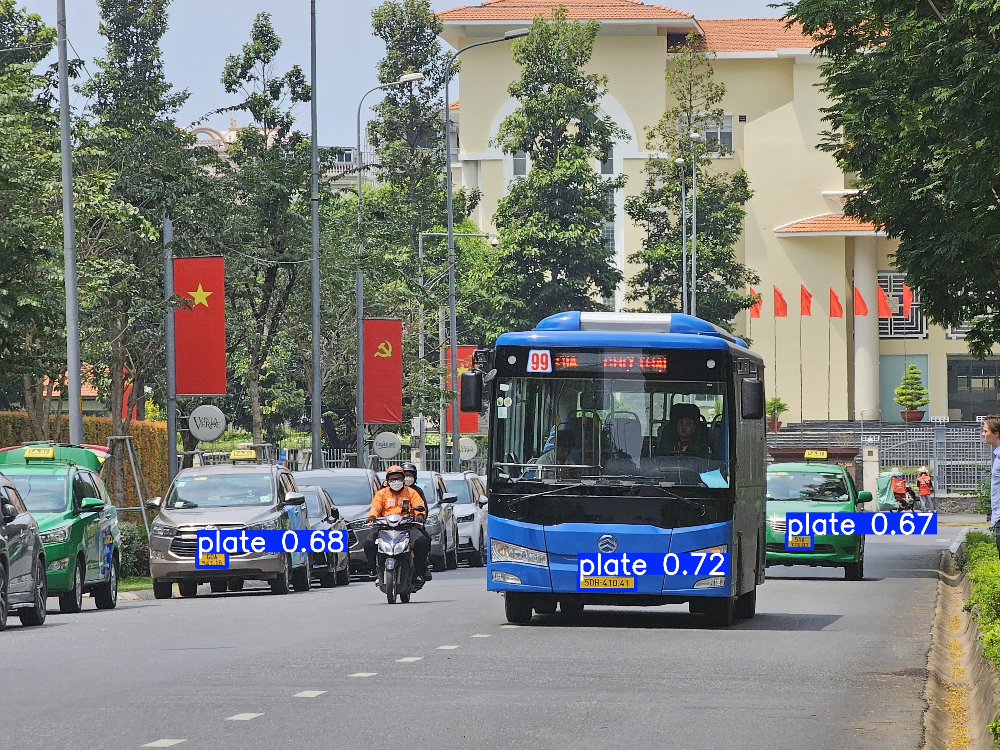
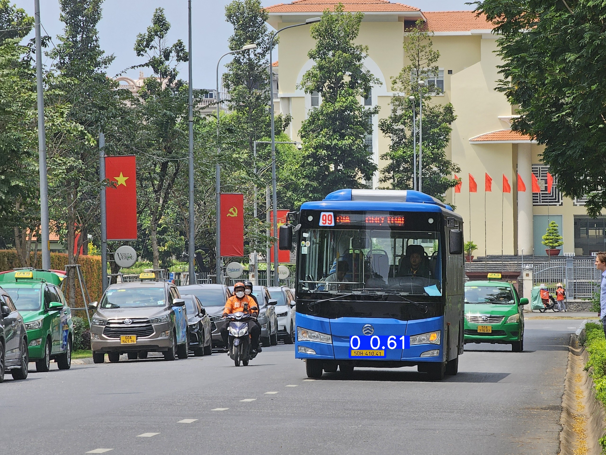
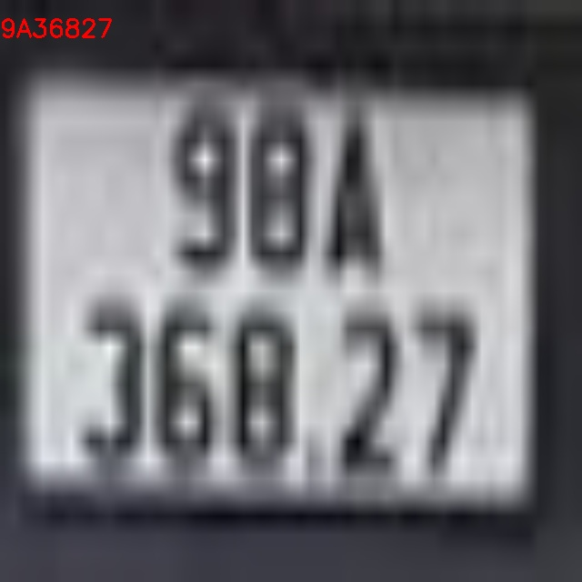

# Hệ thống Nhận diện và Theo dõi Biển số xe (LPR) với YOLO và Docker

Đây là dự án toàn diện ứng dụng Computer Vision để phát hiện phương tiện, khoanh vùng biển số và nhận dạng các ký tự trên biển số từ video. Toàn bộ luồng xử lý (pipeline) được thiết kế tối ưu hiệu năng và đóng gói hoàn chỉnh bằng Docker. Dự án bao gồm hai phiên bản mô hình: `base` (cơ bản) và `improved` (cải tiến với các kỹ thuật như CBAM).

## Demo Video

[](https://youtu.be/ZiOYWaxIXFE)

## So sánh base và improved

- base video:


- improved và base detect license plate (conf=0.5 và iou= 0.5):



- improved và base recognize charactor (conf=0.5 và iou= 0.5):




## Tính năng kỹ thuật nổi bật

- **Phát hiện & Theo dõi xe (Vehicle Detection & Tracking):** Ứng dụng mô hình YOLO kết hợp thuật toán ByteTrack để phát hiện và duy trì ID độc nhất cho từng phương tiện xuyên suốt video.
- **Phát hiện biển số xe (License Plate Detection):** Trích xuất (crop) chính xác vùng chứa biển số dựa trên tọa độ bounding box của phương tiện.
- **Nhận dạng ký tự (OCR) & Sắp xếp không gian:** Nhận diện ký tự và áp dụng thuật toán gom dòng động để xử lý các trường hợp biển số bị nghiêng.
- **Tối ưu hóa hiệu năng:** Chỉ thực thi model OCR mỗi 5 frame để giảm tải tính toán.
- **Nội suy dữ liệu (Data Interpolation):** Ứng dụng thuật toán nội suy tuyến tính (Linear Interpolation) qua Pandas để lấp đầy các khung hình bị mất dấu, đảm bảo quỹ đạo theo dõi mượt mà.

## Cấu trúc dự án

```text
.
├── data/                 # Dữ liệu và script cấu hình cho các mô hình
├── docker-compose.yml    # Cấu hình Docker Compose (bao gồm thiết lập GPU)
├── Dockerfile            # Bản thiết kế môi trường cho ứng dụng
├── requirements.txt      # Các thư viện Python cần thiết
├── sample/               # Chứa video đầu vào (raw_video/) và video đầu ra (output/)
├── scripts/              # Các script phục vụ huấn luyện mô hình
│   ├── base/             # Scripts training cho model cơ bản
│   └── improved/         # Scripts training cho model cải tiến
├── src/                  # Mã nguồn lõi
│   ├── models/           # Định nghĩa cấu trúc, configs và các khối tùy chỉnh (CBAM)
│   ├── pipeline/         # Logic luồng xử lý chính (inference.py, inference_teacher.py)
│   └── utils/            # Các hàm tiện ích (ví dụ: convertOnnx.py)
└── weights/              # Các trọng số model đã huấn luyện
    ├── base/             # Trọng số cho các model cơ bản
    ├── model_license_plate/ # Trọng số cho model phát hiện biển số
    ├── model_numbers/    # Trọng số cho model nhận dạng ký tự
    └── model_vehicle/    # Trọng số cho model phát hiện xe
```

## Bắt đầu

### Cài đặt môi trường Local

1.  **Clone repository:**
    ```bash
    git clone <repository-url>
    cd <repository-directory>
    ```

2.  **Cài đặt thư viện:**
    ```bash
    pip install -r requirements.txt
    ```
    Các thư viện chính bao gồm `ultralytics`, `torch`, `opencv-python`, `pandas`, và `onnxruntime-gpu`.

## Sử dụng (Inference)

### Cách 1: Chạy qua Docker 
Phương pháp này tự động thiết lập môi trường và cấu hình GPU. Đặt video vào `sample/raw_video/` và chạy:

```bash
docker-compose up --build
```
Video kết quả sẽ được xuất ra tại thư mục `sample/output/`.

### Cách 2: Chạy trực tiếp bằng Python
Sử dụng script `src/pipeline/inference.py` với các tham số để tùy chỉnh. Lệnh sau sử dụng các trọng số ONNX mặc định để xử lý video:

```bash
python src/pipeline/inference.py --video_path sample/raw_video/video_cut.mp4 --output_path sample/output/result.mp4 --gap 150
```

## Tiện ích

### Cắt video

Dự án cung cấp script `cutvideo.py` để cắt một đoạn video từ file nguồn, hữu ích cho việc kiểm thử nhanh.

## Huấn luyện (Training)

Các script để huấn luyện các model riêng biệt được đặt trong thư mục `scripts/`. Bạn có thể lựa chọn huấn luyện phiên bản `base` hoặc `improved` tùy theo nhuén cau.

-   `scripts/base/base_vehicle.py`: Huấn luyện model phát hiện xe (bản cơ bản).
-   `scripts/improved/train_vehicle.py`: Huấn luyện model phát hiện xe (bản cải tiến).
-   Tương tự cho các script `..._lp.py` (phát hiện biển số) và `..._reNum.py` (nhận dạng ký tự).

## Các Model

Dự án sử dụng 3 mô hình YOLO riêng biệt cho từng tác vụ:
1.  **Phát hiện phương tiện:** Model `vehicle_detector`.
2.  **Phát hiện biển số:** Model `plate_detector`.
3.  **Nhận dạng ký tự:** Model `recognize_number`.

Mỗi mô hình có hai phiên bản `base` và `improved`. Phiên bản `improved` có thể sử dụng các kiến trúc tùy chỉnh như `YOLO26m` với các khối `CBAM` (định nghĩa trong `src/models/`). Để tối ưu tốc độ inference, các trọng số được khuyến nghị sử dụng là phiên bản đã được chuyển đổi sang định dạng **ONNX**.

### Một số lưu ý:
- Model nhận diện ký tự hoạt động tốt hơn với biển số ô tô so với xe máy.
- Quá trình nội suy có thể chậm khi có nhiều đối tượng trong khung hình.
